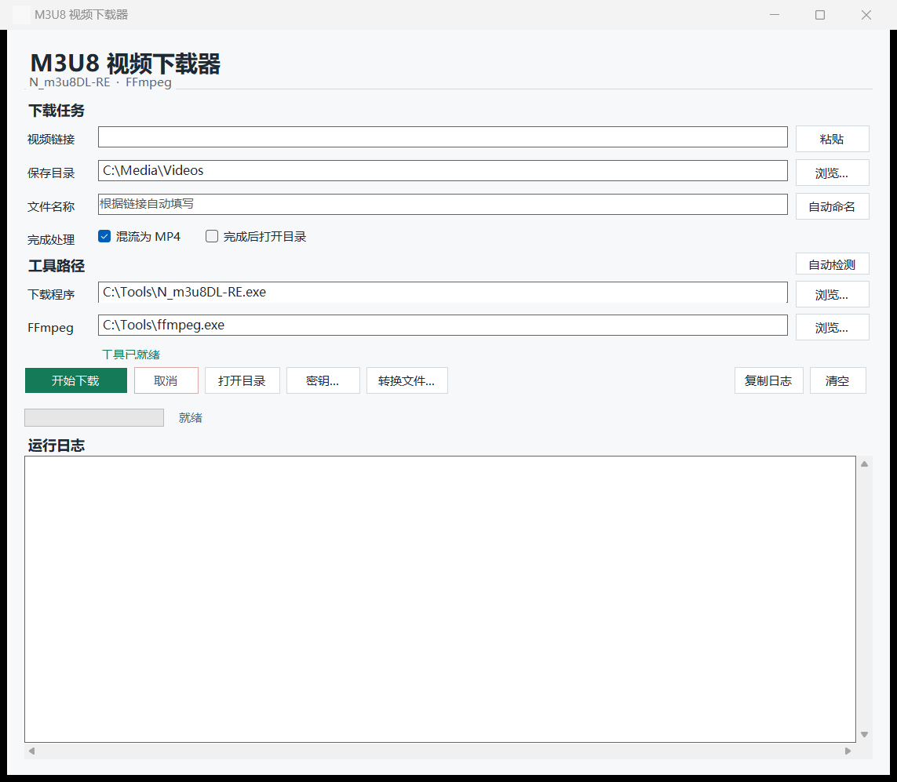

# N_m3u8DL-RE Windows GUI

一个面向 Windows 10/11 的轻量图形界面，用于调用
[`nilaoda/N_m3u8DL-RE`](https://github.com/nilaoda/N_m3u8DL-RE) 下载 HLS/DASH，
并调用 [FFmpeg](https://ffmpeg.org/) 混流或无损重新封装媒体文件。

这是独立的非官方 GUI，不隶属于、也不代表 `nilaoda/N_m3u8DL-RE`。本项目没有复制上游源码；程序把用户提供的官方 `N_m3u8DL-RE.exe` 作为外部进程调用。详细来源和许可见 [THIRD_PARTY_NOTICES.md](THIRD_PARTY_NOTICES.md)。



## 下载 Windows 版本

打开 [Releases](https://github.com/hysterianeko/N_m3u8DL-RE-Windows-GUI/releases/latest)，按需要下载：

- `M3U8-Video-Downloader-v1.2.3-win-x64.exe`：单文件 GUI；启动后会自动检测工具，缺失时可选择自动下载、浏览本机文件或暂不处理。
- `M3U8-Video-Downloader-v1.2.3-win-x64.zip`：包含同一个 GUI、快速开始和备用依赖安装脚本。
- `SHA256SUMS.txt`：两个发布文件的 SHA-256 校验值。

发布包不捆绑第三方可执行文件，因此仍然很小。GUI 会先自动查找现有工具；只有缺失且用户明确选择“自动下载”时，才使用当前网络直连固定的 GitHub Release，不读取 Windows 系统代理，并在下载后校验 SHA-256。通常下载 `N_m3u8DL-RE` 约 5 MB、FFmpeg Essentials 约 32 MB，安装到当前用户的 `%LOCALAPPDATA%\N_m3u8DL-RE-GUI\tools`，不需要管理员权限。自动下载失败时仍可浏览并指定已有 EXE。

运行要求：Windows 10/11 x64、.NET Framework 4.8。实际下载和混流仍需要 `N_m3u8DL-RE.exe` 与 `ffmpeg.exe`，可由 GUI 按需准备或手动指定。本地构建没有数字签名证书，Windows SmartScreen 可能显示“未知发布者”。

## 功能

- 输入在线 `.m3u8`、`.mpd` 或本地播放列表文件。
- 自动从 URL 推断名称；`index.m3u8` / `master.m3u8` 会使用有意义的父目录名。
- 自动选择最佳视频、音频和字幕轨道，并默认混流为 MP4。
- 自动查找 GUI 同目录、`tools`、`PATH`、WinGet，以及各固定磁盘根部的 `Downloads` / `Download` / `下载` 目录中的外部工具。
- 缺少工具时提供自动下载、手动浏览和暂不处理三种选择；自动下载固定版本并校验压缩包与最终 EXE。
- 正确显示下载器中文日志，实时提取分片百分比，并把高频终端重绘压缩为可读的进度里程碑。
- 取消整个进程树后清理该任务的专属下载分片临时目录。
- 任务运行时禁用并灰显“密钥...”和“转换文件...”，结束后恢复。
- 拒绝无法由外部程序访问的 `blob:chrome-extension://...`，支持粘贴猫抓导出的完整 `#EXTM3U` 正文。
- 手动 HLS AES-128 KEY/IV：支持 32 位 HEX、16 字节 Base64 和密钥文件。
- 将现有 TS/M2TS/MKV/MOV/WebM/FLV 等文件无损重新封装为 MP4。
- 仅保存工具路径和界面选项，不保存媒体 URL、运行日志、KEY 或 IV。

## 快速使用

1. 粘贴真实的 `https://...m3u8` 或 `https://...mpd` 地址。
2. 选择保存目录并检查自动生成的文件名；文件名可以修改，不需要输入扩展名。
3. 保持“混流为 MP4”勾选，点击“开始下载”。
4. 下载结束后以界面最终状态和成品完整播放情况为准。

默认下载参数等价于：

```text
--auto-select --ffmpeg-binary-path <ffmpeg.exe> -M format=mp4
```

详细步骤见 [使用说明](docs/USAGE.zh-CN.md)，常见错误见 [故障排查](docs/TROUBLESHOOTING.zh-CN.md)。

## Blob 播放列表

`blob:chrome-extension://...` 只存在于创建它的浏览器或扩展进程中，不是可从桌面程序访问的网络 URL。针对猫抓扩展，在 `M3U8解析器` 中展开切片信息，打开“原始m3u8”，复制从 `#EXTM3U` 开始的完整内容，再回到本程序点击“粘贴”。

HLS 文本中的分片、KEY、MAP 和附加媒体地址必须是完整 URL。MPD 可以使用完整 URL，也可以在作用域内提供绝对 `<BaseURL>` 后使用相对 SegmentTemplate。无法确定 Base URL 的相对引用会被拒绝，避免被错误解析到本机临时目录。

## AES-128 密钥

标准 HLS 通常会从 `#EXT-X-KEY:URI=...` 自动取得密钥，不需要手填。只有自动获取失败且你合法持有密钥时，才点击“密钥...”输入：

- 32 位 HEX，例如 `00112233445566778899aabbccddeeff`
- 解码后正好 16 字节的 Base64，例如 `ABEiM0RVZneImaq7zN3u/w==`
- 包含 16 字节原始数据、HEX 文本或 Base64 文本的文件

IV 同样必须是 16 字节；没有明确值时留空。KEY/IV 会被转换为仅当前 Windows 用户和 `SYSTEM` 可访问的随机临时文件，命令行只传临时路径，任务结束后清理。不要在 Issue、截图或日志中公开真实 KEY、Cookie、Authorization、签名 URL 或 token。

已经合并且仍加密的媒体文件通常不能只靠补一个 KEY 可靠修复，应从保留分片边界的原播放列表重新下载。Widevine、PlayReady 等 DRM 许可证不等同于普通 HLS AES-128 KEY，本项目不提供 DRM 绕过功能。

## 转换已有文件

当 TS 可以播放但总时长或进度条不正确时，点击“转换文件...”，选择源文件和 MP4 输出路径。转换使用 `-c copy`，不会重新编码或损失画质。程序先写入同目录随机 `.partial.mp4`，只有 FFmpeg 成功退出才原子替换最终文件；取消或失败不会破坏已有目标。

## 从源码构建

项目目标为 .NET Framework 4.8 / C# 5，不依赖 NuGet。可以直接打开 `M3u8DownloaderGui.sln`，也可以使用 Windows 自带编译器：

```powershell
powershell.exe -NoProfile -ExecutionPolicy Bypass -File .\build.ps1
```

只生成项目内产物：

```powershell
.\build.ps1 -SkipDesktopCopy
```

生成发布 EXE、轻量 ZIP 和校验文件：

```powershell
.\package.ps1 -Version 1.2.3
```

构建脚本会先编译并运行 `SelfTests.exe`，再生成 DPI 感知的 WinForms EXE。开发细节见 [docs/DEVELOPMENT.md](docs/DEVELOPMENT.md)。

## 安全与合法使用

请只下载、转换你有权访问和保存的内容，并遵守内容提供方条款、版权规定和所在地区法律。安全问题与敏感信息处理见 [SECURITY.md](SECURITY.md)。

本 GUI 源码采用 [MIT License](LICENSE)。`N_m3u8DL-RE`、FFmpeg 及其发行包使用各自上游许可证；参见 [第三方声明](THIRD_PARTY_NOTICES.md)。
